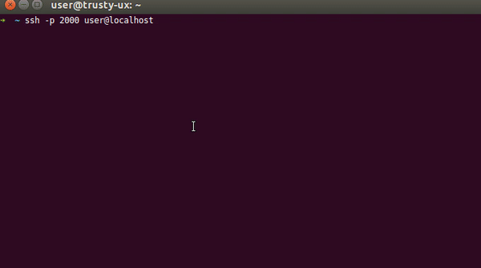

Spring Context from Groovy
==========================



`spring-ctx-groovy` contain the class `ctx.App`, that
it's built with Groovy and exposes the Spring context statically.

You can get a bean object from the context like this in **Java**, without the
need to inject the bean into your class:

```java
MyUserService myUserService = (MyUserService) ctx.App.getContext().getBean("myUserService");
```

Or like this with **Groovy**:

```groovy
def myUserService = ctx.App.myUserService
```

But the most important feature is to use it with the
[Remote Shell](http://docs.spring.io/spring-boot/docs/1.4.6.RELEASE/reference/html/production-ready-remote-shell.html)
included in the *Spring Boot Actuator* module, to access within the console through a SSH session
to the Spring Context using the `repl groovy`, like in the awesome *Grails Console*.

> :warning: *[Deprecated Module]* Unfortunately, because the project rely on the Remote Shell that
  was discontinued in Spring Boot 2.0+, the project only works with Spring Boot 1.x projects.
  To debug a Spring Boot 2.0+ project with a shell console,
  try [jshell-plugin](https://github.com/mrsarm/jshell-plugin#spring-boot-applications) along
  with [spring-ctx](https://github.com/mrsarm/spring-ctx). Though they have some limitations, like
  the need to build the project with JDK 9 or higher, and using Gradle (Maven not supported).


```
$ ssh -p 2000 user@localhost
user@localhost's password:
  .   ____          _            __ _ _
 /\\ / ___'_ __ _ _(_)_ __  __ _ \ \ \ \
( ( )\___ | '_ | '_| | '_ \/ _` | \ \ \ \
 \\/  ___)| |_)| | | | | || (_| |  ) ) ) )
  '  |____| .__|_| |_|_| |_\__, | / / / /
 =========|_|==============|___/=/_/_/_/
 :: Spring Boot ::  (v1.4.6.RELEASE) on myhost
> repl groovy
Using repl groovy
> ctx.App.myUserService.findUserByEmail("mrsarm@gmail.com")[0].id
100123
> ctx.App.myUserService.getById(100123).name
Mariano Ruiz
> ctx.App.contactDao.logger.effectiveLevel
INFO
> ctx.App.contactDao.logger.setLevel(ch.qos.logback.classic.Level.DEBUG)
```

Also exposes the properties of the project with the `prop` static method:

```bash
> ctx.App.prop("server.context-path")
/api
```

When an object is returned, the repl prints a representation of the
object (call the `toString()` method), but sometimes is not the
best way to read the result, or you just need a JSON representation:

```bash
> ctx.App.json(statusObj)
{"queue_info":{"active_count":0,"core_pool_size":50}}
```

The default [ObjectMapper](https://docs.spring.io/spring-boot/docs/current/reference/html/howto-spring-mvc.html#howto-customize-the-jackson-objectmapper)
is used to serialize to JSON.

**NOTE**: You DON'T need to develop your project with Groovy to use this
library in your Spring Project and access to the `ctx.App` class
from your source code, or from the remote shell.


Configuration
-------------

To add this library to your project, depending of your building
tool, these are the configuration settings you need:

### Maven

Add the following configuration to the `pom.xml` file
of your project:

1. `dependencies` section:

   ```xml
   <dependency>
       <groupId>ar.com.grayshirts</groupId>
       <artifactId>spring-ctx-groovy</artifactId>
       <version>1.1.0</version>
   </dependency>
   <!-- Remote Shell Library for Spring Boot applications -->
   <dependency>
        <groupId>org.springframework.boot</groupId>
        <artifactId>spring-boot-starter-remote-shell</artifactId>
   </dependency>
   ```

2. `repositories` section:

   ```xml
   <repository>
       <id>grayshirts-public</id>
       <name>Grayshirts Public Repository</name>
       <url>https://dl.bintray.com/grayshirts/public</url>
   </repository>
   ```

### Gradle

Add the following configuration to the `build.gradle` file
of your project:

1. `dependencies` section:

   ```groovy
   compile 'ar.com.grayshirts:spring-ctx-groovy:1.1.0'
   // Remote Shell Library for Spring Boot applications
   compile 'org.springframework.boot:spring-boot-starter-remote-shell'
   ```

2. `repositories` section:

   ```groovy
   maven() {
       url "https://dl.bintray.com/grayshirts/public"
   }
   ```


System Requirements
-------------------

 * JDK 7+


Build & Publish
---------------

Compile and build the .jar locally with:

```bash
$ ./gradlew build
```

Publish to your local Maven repo:

```bash
$ ./gradlew publishToMavenLocal
```

Upload to Bintray repo:

```bash
$ ./gradlew bintrayUpload
```


Links
-----

 * **Remote Shell DOC**:
   http://docs.spring.io/spring-boot/docs/1.4.6.RELEASE/reference/html/production-ready-remote-shell.html
 * **How to setup simple login to remote shell**:
   http://docs.spring.io/spring-boot/docs/1.4.1.RELEASE/api/org/springframework/boot/actuate/autoconfigure/CrshAutoConfiguration.html
 * **CRaSH home**: http://crashub.org/
 * `Unable to negotiate key exchange for server host key algorithms` **error on shell startup fix**:
   https://github.com/spring-projects/spring-boot/issues/3501


About
-----

Project: https://github.com/grayshirts/spring-ctx-groovy

Bintray Artifacts Repository: https://bintray.com/grayshirts/public/spring-ctx-groovy

Author: Mariano Ruiz <mrsarm@gmail.com>

License: [Apache Software License 2.0](https://www.apache.org/licenses/LICENSE-2.0).

(2017) Grayshirts.
